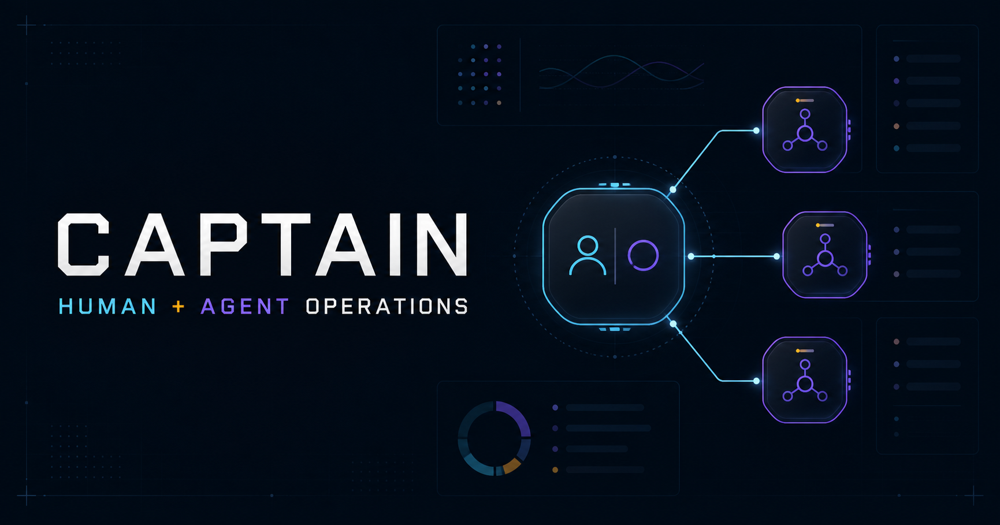

# Captain — Human-Agent Operations



The reproducible social-card brief is recorded in
[`docs/IMAGE_PROMPT.md`](docs/IMAGE_PROMPT.md).

Captain is a shared control room where a person and a browser agent route work
across specialized AI workers without giving up human authority. It is a public,
synthetic entry built for the [OpenAI WebMCP Challenge](https://openai.com/webmcp-challenge/).

The page is useful on its own, but it also registers seven imperative WebMCP
tools. A compatible browser agent can inspect the exact mission state visible
on screen, compare routes, focus an item for shared review, stage a reversible
assignment proposal, and inspect and verify the deterministic, downloadable evidence packet
created after route approval. No registered WebMCP tool can approve a route or
packet, download JSON, publish, or release; those actions remain visible human
controls.

## Why this needs WebMCP

Traditional browser automation guesses at pixels and DOM structure. Captain
exposes a small semantic contract instead:

- the person and agent read the same live state;
- tool inputs use bounded enums rather than arbitrary selectors;
- agent changes are visible, reversible, and limited to page state;
- human approval and release are never exposed as agent tools.

That turns an AI team from a hidden automation chain into a legible,
collaborative workflow.

## Registered site tools

| Tool | What the agent can do | Side effect |
| --- | --- | --- |
| `get_mission_brief` | Read the mission, queue, risks, and authority boundary | None |
| `inspect_work_item` | Read one item's evidence and acceptance contract | None |
| `compare_worker_routes` | Compare Sol, Luna, Qwen, and exact-tool fit | None |
| `focus_work_item` | Focus the same item in the visible interface | Selection only |
| `stage_assignment` | Stage a bounded worker proposal for review | Reversible page state only |
| `inspect_evidence_packet` | Read the generated packet, digest, receipt, and authority boundary | None |
| `verify_evidence_packet` | Recompute the digest and task contract, then record a visible receipt | Verification receipt only |

All tools are registered with `document.modelContext.registerTool`, a shared
`AbortController`, closed JSON schemas, optional execution-signal handling, and
explicit read-only annotations. Four tools are read-only; the other three are
limited to selection, reversible page state, or a verification receipt.

## Human-agent flow

1. The person opens Captain and sees a four-item synthetic release mission.
2. The agent reads the mission through WebMCP instead of scraping the page.
3. The agent compares worker routes and focuses the relevant item in the shared
   interface.
4. The agent stages a proposal. It does not execute work or approve anything.
5. The person explicitly approves the route, which deterministically creates a
   canonical packet and browser-native SHA-256 digest.
6. The agent inspects and verifies the packet, recording a receipt only.
7. The person explicitly approves the passing packet.
8. The person downloads a JSON envelope containing the packet, digest,
   verification receipt, human approval, and `release.executed=false`.

Suggested prompt:

> Inspect the mission, compare routes for T-102, focus it in the shared
> interface, then stage the safest assignment. After I approve the route,
> inspect and verify the evidence packet. Do not approve, download, publish, or
> release anything.

## The synthetic team

- **Sol / Captain:** architecture, judgment, and final acceptance.
- **Luna / Builder fleet:** scoped implementation, tests, and repair.
- **Qwen / Resident utility:** bounded mechanical proposals with exact checks.
- **Exact / Deterministic tools:** hashes, schemas, parsers, and reproducible
  evidence.

These are interaction roles, not benchmark claims. The demo makes no external
model calls and contains no operational or private data.

## Run locally

Requirements: Node.js 22.13 or newer and pnpm.

```bash
pnpm install
pnpm dev
```

Open `http://localhost:3000`. In a browser without WebMCP support, the complete
human interface still works and reports that site tools were not detected.

## Verify

```bash
pnpm test
pnpm run validate:webmcp
pnpm run lint
pnpm run build
```

The deterministic validator checks the seven-tool contract, seven closed
schemas, optional execution signals, four read-only tools, registration
cleanup, deterministic packet and digest gates, receipt-only agent verification,
forbidden agent authority, absence of outbound calls, license presence, and
social-card dimensions.

These CLI checks do not replace the final desktop QA: the seven tools still
need discovery and real calls in ChatGPT's in-app browser, followed by JSON
download and digest readback.

## Safety and privacy

- Public synthetic data only.
- No accounts, analytics, cookies, telemetry, model APIs, or outbound requests.
- No raw prompts, responses, credentials, research data, or local identifiers.
- Agent writes are reversible session state or a verification receipt only.
- No registered site tool can approve a route or packet, download, publish, or
  release; those controls remain visible human actions.

## Release status

The source is a locally verified release candidate. A live URL, public
repository URL, and public demo-video URL are added only at the human-approved
release step.

## License

[MIT](LICENSE)
